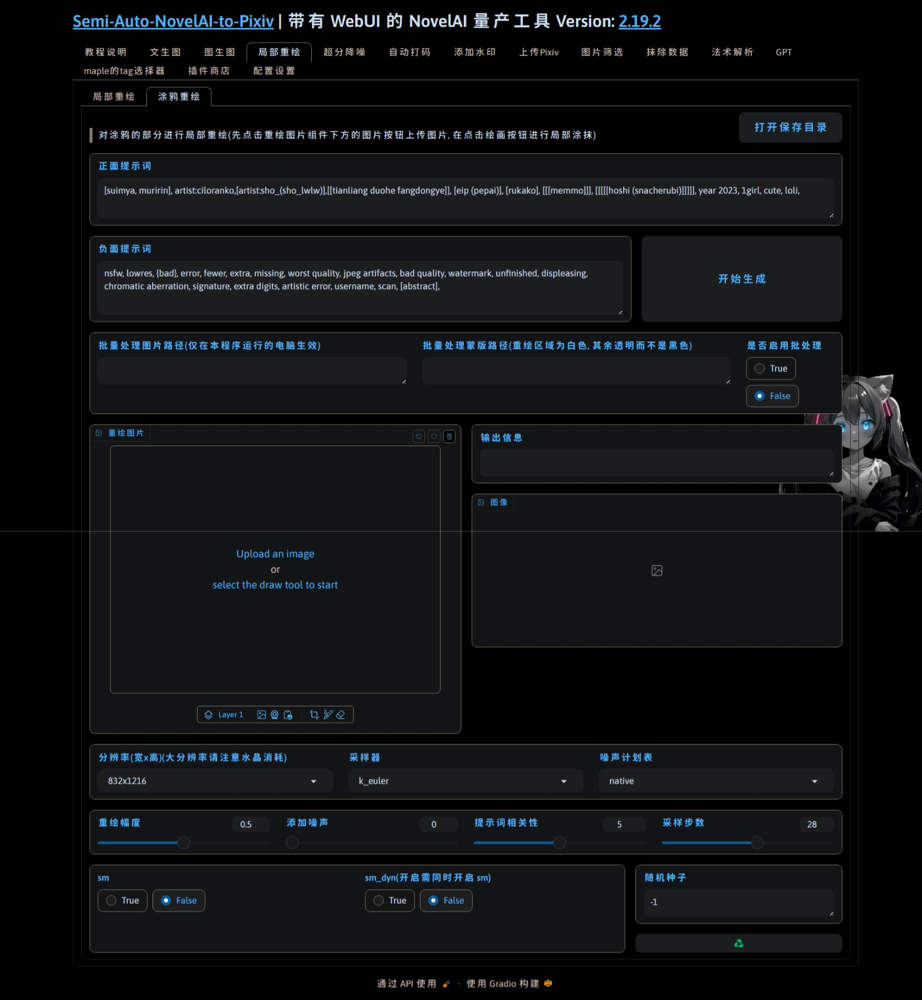
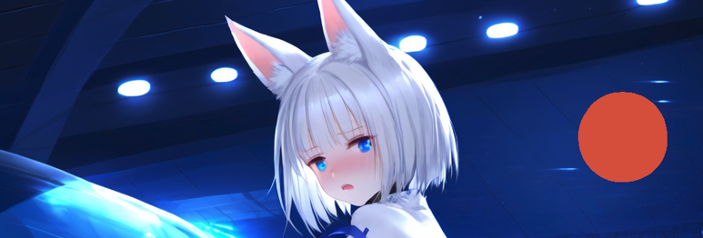

  </a>

<h1 align="center">sanp_plugin_draw_inpaint</h1>
<h4 align="center">✨适用于 Semi-Auto-NovelAI-to-Pixiv 涂鸦重绘插件✨</h4>

    
    
    
    
    

## 💬 介绍

通过对涂鸦部分进行局部重绘实现

## ✨ 功能

| 原图 | 涂鸦 | 重绘 |
| :---: | :---: | :---: |
|  |  |  |

## 💿 安装

- 方法1. 在插件商店粘贴本插件名字(sanp_plugin_draw_inpaint)并点击安装

- 方法2. 在[主体项目](https://github.com/zhulinyv/Semi-Auto-NovelAI-to-Pixiv) `plugins\t2i` 目录下直接克隆本项目
